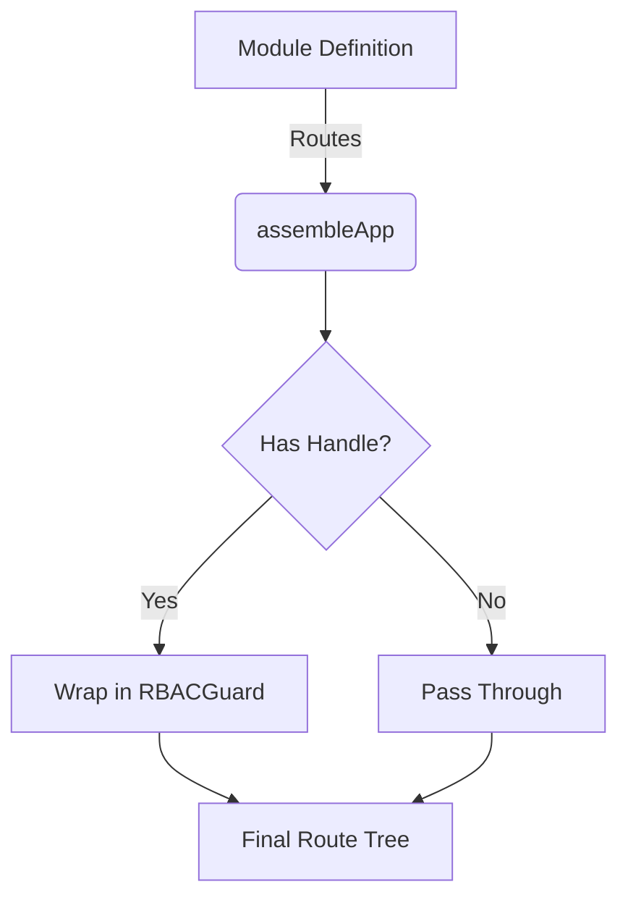

# Module Type Contracts

This directory contains TypeScript interface contracts that define the boundaries between modules.

## What Are Module Contracts?

Module contracts are TypeScript interfaces that define:

1. **Service Contracts** - What methods a service must implement
2. **Data Contracts** - The shape of data passed between modules
3. **Component Contracts** - Props interfaces for reusable components
4. **RBAC Guard Logic** - How modules define and enforce permissions (LEGO contract)

## What is the LEGO Contract?

The "LEGO contract" refers to the plug-and-play nature of our modules. Each module is a self-contained unit that adheres to a strict interface (`CAPModule`), allowing it to be assembled into any application matching the core platform's standards.

## RBAC Guard Logic

In the LEGO architecture, modules are responsible for defining their own security requirements, while the core platform is responsible for enforcing them.

### 1. Defining Permissions in Routes

Modules specify access requirements using the `handle` property in their `RouteObject` definitions.

```typescript
// packages/modules/inventory/src/routes.tsx
export const inventoryRoutes: RouteObject[] = [
  {
    path: '/inventory',
    element: <InventoryScreen />,
    handle: {
      requiredRoles: [Roles.ADMIN, Roles.PROVIDERADMIN],
      requiredPermissions: ['inventory.view'],
      authOnly: true
    }
  }
]
```

### 2. The RBAC Contract Interface

The `RouteHandle` defines the standard metadata that the assembly system understands:

```typescript
export interface RouteHandle {
  /** Roles authorized for this route (OR logic) */
  requiredRoles?: Roles[]

  /** Specific permission identifiers (AND logic) */
  requiredPermissions?: string[]

  /** Route is strictly for non-authenticated users */
  guestOnly?: boolean

  /** Route requires any valid active session */
  authOnly?: boolean
}
```

### 3. Core Enforcement (The Assembly Phase)

The `assembleApp` function in `platform-core` automatically processes these handles and wraps the module elements in a central `RBACGuard`.



### 4. RBAC Guard Evaluation Logic

The `RBACGuard` component executes the following priority-based check:

1. **Authenticated?**: If route is `authOnly` and user is not logged in → Redirect to Login.
2. **Guest Only?**: If route is `guestOnly` and user is logged in → Redirect to Dashboard.
3. **Role Check**: If `requiredRoles` exists, check if `user.role` is in the list.
4. **Permission Check**: If `requiredPermissions` exists, check if user's permission set satisfies the requirement.

---

## Why Interfaces Over Types?

For module contracts, **prefer `interface` over `type`**:

### ✅ Interfaces - Better for Contracts

```typescript
// Extendable and mergeable
export interface IUserService {
  getUser(id: string): Promise<IUser>
  updateUser(id: string, data: Partial<IUser>): Promise<IUser>
}

// Can be extended
export interface IAdminUserService extends IUserService {
  deleteUser(id: string): Promise<void>
  banUser(id: string, reason: string): Promise<void>
}

// Declaration merging (useful for augmenting external libraries)
export interface IUser {
  id: string
  name: string
}

export interface IUser {
  email: string // Merged with above
}
```

### ❌ Types - Better for Unions/Utilities

```typescript
// Use types for unions, intersections, mapped types
export type UserRole = 'admin' | 'user' | 'guest'
export type DeepPartial<T> = { [K in keyof T]?: DeepPartial<T[K]> }
```

## Contract Naming Convention

- **Services**: `I[Name]Service` (e.g., `IUserService`, `IAuthService`)
- **Data Models**: `I[Name]` (e.g., `IUser`, `IProduct`)
- **Requests/Responses**: `I[Action][Type]` (e.g., `ILoginRequest`, `IAuthResponse`)
- **Component Props**: `[Component]Props` (e.g., `UserCardProps`)

## Contract Examples

### Service Contract

```typescript
// contracts/IAuthService.ts
export interface IAuthService {
  /**
   * Authenticate user with credentials
   * @throws AuthError if credentials are invalid
   */
  login(credentials: ILoginCredentials): Promise<IAuthResponse>

  /**
   * Log out current user
   */
  logout(): Promise<void>

  /**
   * Get currently authenticated user
   * @returns User object or null if not authenticated
   */
  getCurrentUser(): Promise<IUser | null>

  /**
   * Refresh authentication token
   */
  refreshToken(refreshToken: string): Promise<IAuthResponse>
}

export interface ILoginCredentials {
  email: string
  password: string
  rememberMe?: boolean
}

export interface IAuthResponse {
  user: IUser
  accessToken: string
  refreshToken: string
  expiresIn: number
}
```

### Data Contract

```typescript
// IUser.ts
/**
 * User entity representing an authenticated user
 */
export interface IUser {
  /** Unique user identifier */
  id: string

  /** User's full name */
  name: string

  /** User's email address */
  email: string

  /** User's role in the system */
  role: UserRole

  /** URL to user's avatar image */
  avatarUrl?: string

  /** Timestamp when user was created */
  createdAt: Date

  /** Timestamp when user was last updated */
  updatedAt: Date
}

export type UserRole = 'admin' | 'user' | 'guest'
```

### Component Props Contract

```typescript
// components/UserCard.tsx
export interface UserCardProps {
  /** User data to display */
  user: IUser

  /** Whether to show the user's email */
  showEmail?: boolean

  /** Whether to show edit button */
  editable?: boolean

  /** Callback when user clicks edit */
  onEdit?: (user: IUser) => void

  /** Callback when user clicks delete */
  onDelete?: (userId: string) => void

  /** Additional CSS class name */
  className?: string
}
```

## How Backend Changes Propagate

### Example: Adding a Field to User

**Step 1**: Backend adds `phoneNumber` field

```typescript
// Update contract in src/types/IUser.ts
export interface IUser {
  id: string
  name: string
  email: string
  phoneNumber?: string // NEW FIELD
  role: UserRole
  // ...
}
```

**Step 2**: TypeScript immediately shows errors

```typescript
// src/services/api/user.service.ts
async updateUser(id: string, data: Partial<IUser>) {
  // ✓ TypeScript knows about phoneNumber now
  // ✓ Autocomplete works
  // ✓ Typos are caught
  const response = await apiClient.patch<IUser>(`/api/users/${id}`, {
    ...data,
    phoneNumer: data.phoneNumber  // ❌ TypeScript error: typo!
  })
  return response.data
}
```

**Step 3**: UI components use new field

```typescript
// src/app/components/UserProfile.tsx
export function UserProfile({ user }: { user: IUser }) {
  return (
    <div>
      <h2>{user.name}</h2>
      <p>{user.email}</p>
      {user.phoneNumber && <p>{user.phoneNumber}</p>}  // ✓ Works!
    </div>
  )
}
```

### Example: Changing a Method Signature

**Step 1**: Backend changes login to require 2FA

```typescript
// Update contract
export interface IAuthService {
  login(
    credentials: ILoginCredentials,
    twoFactorCode?: string, // NEW PARAMETER
  ): Promise<IAuthResponse>
}
```

**Step 2**: Service implementation shows error

```typescript
// src/services/auth.service.ts
export const authService: IAuthService = {
  // ❌ TypeScript error: signature doesn't match
  async login(credentials: ILoginCredentials) {
    // Missing twoFactorCode parameter
  },
}
```

**Step 3**: Fix implementation

```typescript
export const authService: IAuthService = {
  async login(credentials: ILoginCredentials, twoFactorCode?: string) {
    const response = await apiClient.post<IAuthResponse>('/api/auth/login', {
      ...credentials,
      twoFactorCode,
    })
    return response.data
  },
}
```

## Best Practices

### 1. Document Your Contracts

Use JSDoc comments:

```typescript
/**
 * Service for managing user data
 */
export interface IUserService {
  /**
   * Retrieve a user by ID
   * @param id - Unique user identifier
   * @returns Promise resolving to user object
   * @throws UserNotFoundError if user doesn't exist
   */
  getUser(id: string): Promise<IUser>
}
```

### 2. Use Readonly for Immutable Data

```typescript
export interface IUser {
  readonly id: string // Can't be changed
  readonly createdAt: Date // Can't be changed
  name: string // Can be changed
  email: string // Can be changed
}
```

### 3. Use Optional Properties Appropriately

```typescript
// ✅ Good - optional because it might not exist
export interface IUserProfile {
  bio?: string
  avatarUrl?: string
}

// ❌ Bad - should be required or use null
export interface IUser {
  id?: string // ID should always exist!
}

// ✅ Better - explicit nullability
export interface IAuthState {
  user: IUser | null // Explicitly nullable
}
```

### 4. Separate Concerns

```typescript
// ✅ Good - separate request and response

export interface IUpdateUserRequest {
  name?: string
  email?: string
}

export interface IUpdateUserResponse {
  user: IUser
  updatedFields: string[]
}

// ❌ Bad - mixing concerns
export interface IUserData {
  // Request fields
  name?: string
  // Response fields
  id: string
  createdAt: Date
}
```

### 5. Use Generic Contracts Where Appropriate

```typescript
// Generic API response wrapper
export interface IApiResponse<T> {
  data: T
  message: string
  success: boolean
}

// Generic paginated response
export interface IPaginatedResponse<T> {
  items: T[]
  total: number
  page: number
  pageSize: number
}

// Usage
type UserListResponse = IPaginatedResponse<IUser>
type ProductListResponse = IPaginatedResponse<IProduct>
```

## Contract Location Structure

```
src/types/
├── contracts/           # Service contracts
│   ├── IAuthService.ts
│   ├── IUserService.ts
│   └── README.md       # This file
├── IUser.ts            # User data contract
├── IAuth.ts            # Auth data contracts
├── Response.ts         # Generic response types
├── job.ts              # Job-related contracts
├── profile.ts          # Profile contracts
└── index.ts            # Re-exports
```

## Re-exporting Contracts

Make contracts easy to import:

```typescript
// src/types/index.ts
export type { IUser, UserRole } from './IUser'
export type { IAuthService, ILoginCredentials, IAuthResponse } from './contracts/IAuthService'
export type { IUserService } from './contracts/IUserService'
export type { IApiResponse, IPaginatedResponse } from './Response'
```

Usage:

```typescript
// ✅ Good - single import
import type { IUser, IAuthService } from '@/types'

// ❌ Avoid - multiple imports
import type { IUser } from '@/types/IUser'
import type { IAuthService } from '@/types/contracts/IAuthService'
```

## Testing Contracts

Contracts themselves don't need tests, but implementations do:

```typescript
// __tests__/auth.service.test.ts
import { authService } from '@/services/auth.service'
import type { IAuthService } from '@/types/contracts/IAuthService'

// Verify implementation matches contract
const service: IAuthService = authService // ✓ Type-checks

describe('AuthService', () => {
  it('implements IAuthService contract', () => {
    expect(service).toHaveProperty('login')
    expect(service).toHaveProperty('logout')
    expect(service).toHaveProperty('getCurrentUser')
  })
})
```

## Migration Guide

### Converting Types to Interfaces

If you have existing `type` exports that should be interfaces:

```typescript
// Before
export type User = {
  id: string
  name: string
}

// After
export interface IUser {
  id: string
  name: string
}
```

Update all imports:

```typescript
// Before
import type { User } from '@/types'

// After
import type { IUser } from '@/types'
```

TypeScript will show errors everywhere `User` is used, making it easy to update.

## Summary

✅ **DO:**

- Use `interface` for contracts
- Document with JSDoc
- Use descriptive names (`IUserService`, not `UserSvc`)
- Make immutable fields `readonly`
- Separate request/response types
- Re-export from `index.ts`

❌ **DON'T:**

- Use `any` type (use `unknown` if truly unknown)
- Mix request and response in same interface
- Use `type` for extendable contracts
- Skip documentation
- Make everything optional

---

## See Also

- [Architectural Rules](../../docs/architecture/RULES.md) - Rule 3: Strict Type Contracts
- [Module Boundaries](../../docs/architecture/MODULE_BOUNDARIES.md) - Module structure
- [TypeScript Handbook](https://www.typescriptlang.org/docs/handbook/intro.html) - Official docs
